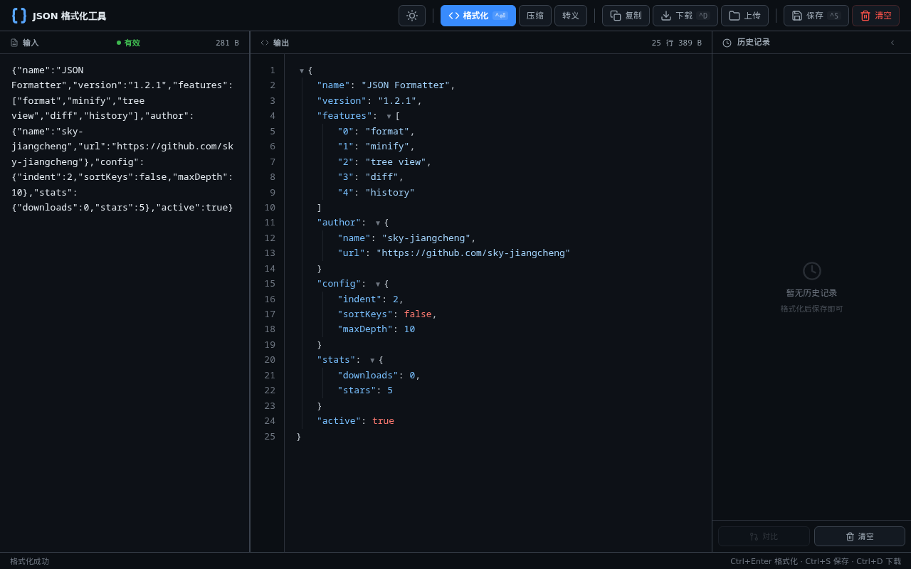
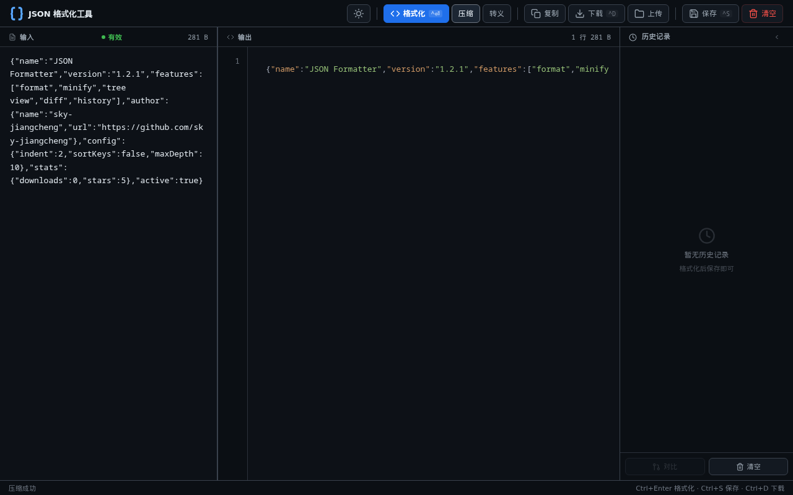
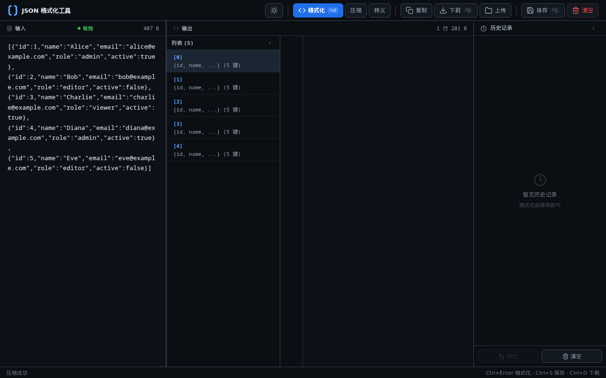
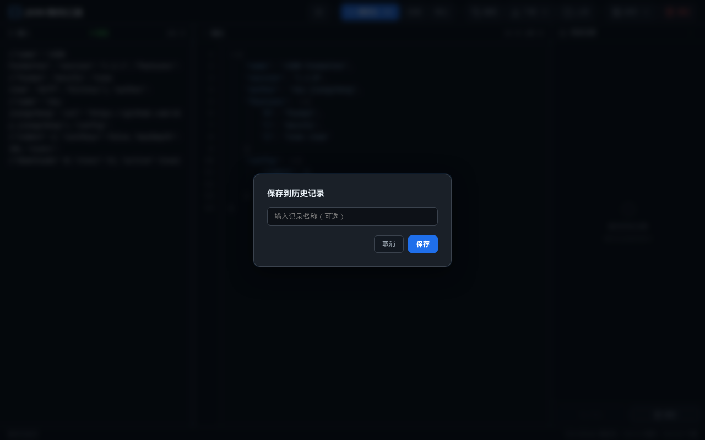
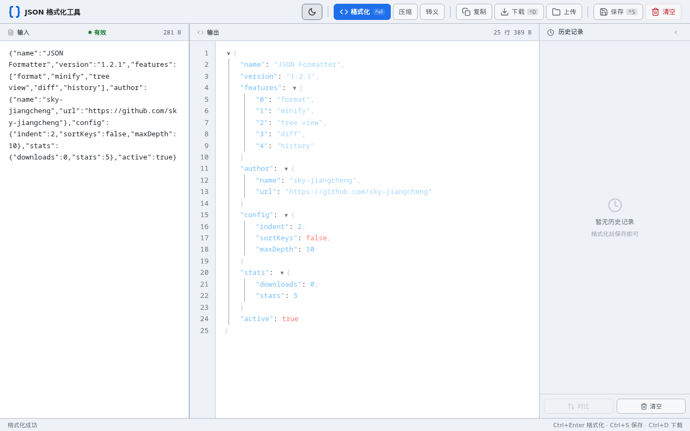
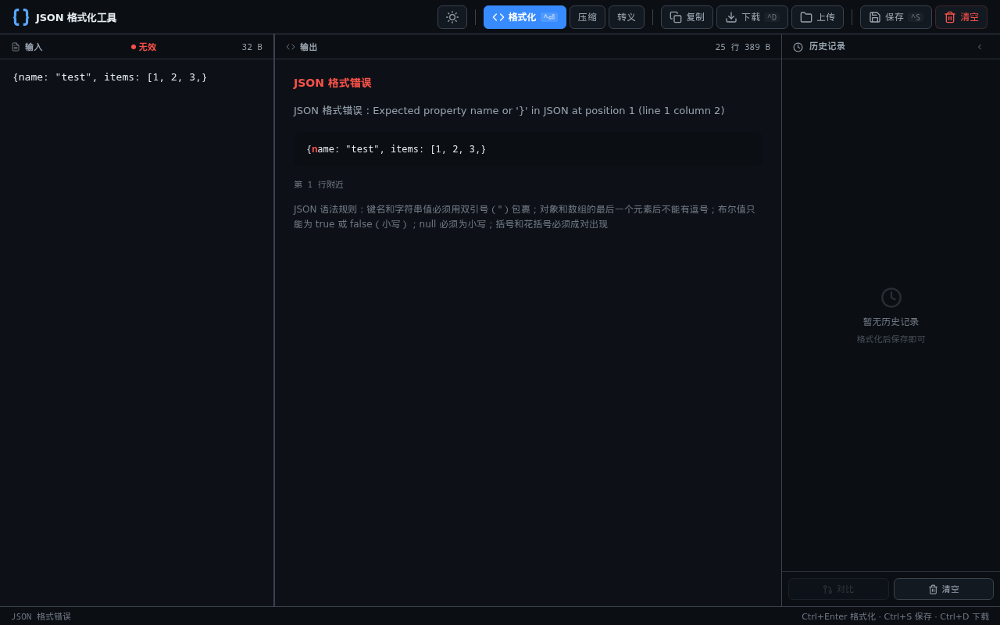

# JSON 格式化工具

一个现代化的 JSON 格式化与验证工具，纯前端单文件实现，支持桌面端。

**在线使用**: https://sky-jiangcheng.github.io/jsonbeautify/

## 截图

| 格式化 | 压缩 |
|--------|------|
|  |  |

| 列表/详情视图 | JSON 对比 |
|--------------|-----------|
|  |  |

| 历史记录 | 暗色模式 |
|----------|----------|
|  |  |

| 错误提示 |
|----------|
|  |

## 功能

### JSON 处理
- **格式化** — 2 空格缩进，语法高亮，可交互的 collapsible 树形视图
- **压缩** — 单行紧凑输出
- **转义** — JSON 字符串转义/反转义
- **自动修复** — 缺失括号时自动补全，未加引号的键名自动修复
- **实时验证** — 红/绿灯指示 JSON 有效性（400ms 防抖）

### 交互式 JSON 树
- 对象/数组节点可展开/折叠（`▼` / `▶` 切换）
- 折叠时显示节点摘要（`{3 键}` / `[5 项]`）
- 行号列同步滚动

### 列表/详情视图
- 数组类型 JSON 自动切换为左右分栏模式
- 左侧列表项带预览摘要，点击切换右侧详情
- 列表面板可折叠

### JSON 对比
- 结构化递归比对（非文本行比对），按键/索引匹配
- 差异高亮：绿色 = 新增，红色 = 删除，黄色 = 修改
- 左右双树独立渲染，保留展开/折叠交互
- 滚动同步，支持交换左右

### 历史记录
- 格式化后可保存到本地历史（localStorage）
- 点击加载历史记录并自动格式化
- 最多同时选中 2 条进行对比
- 侧边栏可折叠

### 主题切换
- 暗色模式（GitHub Dark）
- 亮色模式（GitHub Light）
- 偏好存入 localStorage，刷新保持

### 快捷键

| 快捷键 | 操作 |
|--------|------|
| `Ctrl+Enter` | 格式化 |
| `Ctrl+S` | 保存到历史 |
| `Ctrl+D` | 下载 JSON 文件 |
| `Escape` | 关闭弹窗/对比视图 |

macOS 上使用 `Cmd` 替代 `Ctrl`。

### 拖放
支持拖拽 `.json` 文件到输入区域自动加载并格式化。

## 桌面应用 (Tauri)

支持打包为原生桌面应用，每次推送 `v*` tag 自动构建三平台安装包。

[](https://github.com/sky-jiangcheng/jsonbeautify/releases)

### 本地构建

**依赖**:
- [Rust](https://rustup.rs/)
- [Node.js](https://nodejs.org/)
- Linux: `sudo apt install libwebkit2gtk-4.1-dev libgtk-3-dev libssl-dev`
- macOS: Xcode Command Line Tools
- Windows: Microsoft Visual Studio C++ Build Tools + WebView2

**构建**:
```bash
npm install
npm run build
```

产物在 `src-tauri/target/release/bundle/` 目录。

## 技术栈

- 纯 HTML/CSS/JavaScript，无框架依赖
- 语法高亮: highlight.js
- 存储: localStorage
- 桌面端: Tauri v2 (Rust)

## 部署

纯静态站点，部署到任意托管服务：

```bash
# 本地开发
python3 -m http.server 8000
```

已部署于 GitHub Pages: https://sky-jiangcheng.github.io/jsonbeautify/

## 文件结构

```
index.html                  — 完整应用 (HTML + CSS + JS)
src-tauri/                  — Tauri v2 桌面应用 (Rust)
docs/screenshots/           — 截图
.github/workflows/          — CI/CD (GitHub Pages + Release)
```
