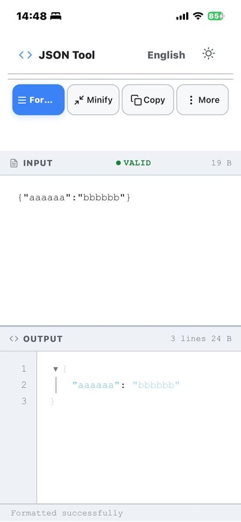
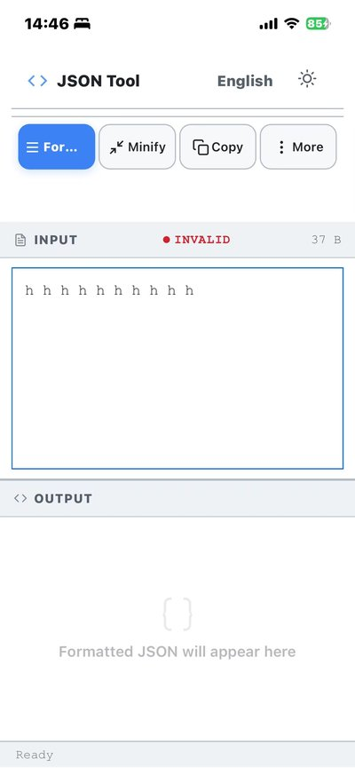
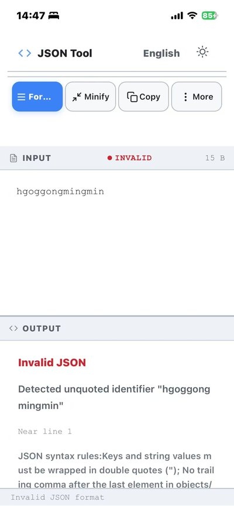
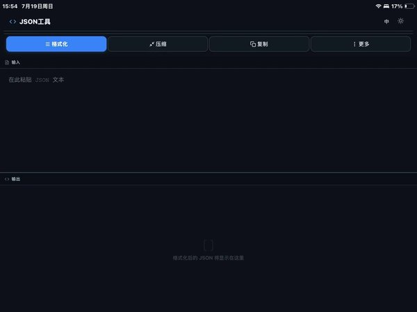
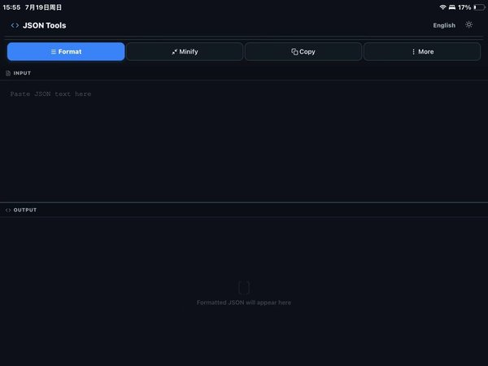
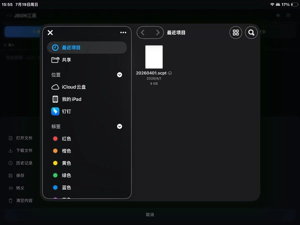
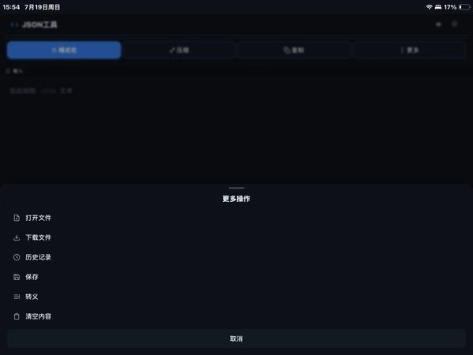
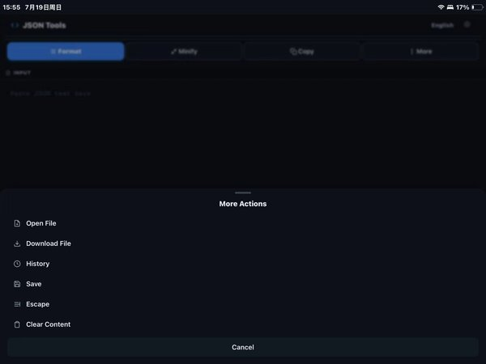

# JSON 格式化工具

一个现代化的 JSON 格式化、压缩、验证与对比工具。纯前端单文件实现，支持 Web / 桌面端 / iOS。

> **在线使用** → [sky-jiangcheng.github.io/jsonbeautify](https://sky-jiangcheng.github.io/jsonbeautify/)

---

## 截图

### 📱 手机端 Phone

| 空状态首页 | 格式化成功 | 非法输入 |
|:---:|:---:|:---:|
|  |  |  |

| 错误提示 | 更多操作弹窗 |
|:---:|:---:|
|  |  |

### 📟 iPad

| 主界面 | 编辑界面 | 文件选择器 |
|:---:|:---:|:---:|
|  |  |  |

| 更多操作 | 更多操作（折叠） |
|:---:|:---:|
|  |  |

> 截图源文件见 [`screenshots/`](screenshots/) 目录，按平台分 `phone/` 和 `ipad/` 子目录存放。

---

## 功能

### 🔧 JSON 处理
| 功能 | 说明 |
|------|------|
| **格式化** | 2 空格缩进，语法高亮，可交互的树形视图 |
| **压缩** | 单行紧凑输出 |
| **转义/反转义** | JSON 字符串转义处理 |
| **自动修复** | 缺失括号自动补全，未加引号的键名自动修复 |
| **实时验证** | 红灯/绿灯指示 JSON 有效性（400ms 防抖） |

### 🌲 交互式 JSON 树
- 对象 / 数组节点可展开 / 折叠（`▼` / `▶` 切换）
- 折叠时显示节点摘要（`{3 键}` / `[5 项]`）
- 行号列同步滚动

### 📋 列表/详情视图
- 数组类型 JSON 自动切换为左右分栏模式
- 左侧列表项带预览摘要，点击切换右侧详情
- 列表面板可折叠

### 🔄 JSON 对比
- 结构化递归比对（非文本行比对），按键 / 索引匹配
- 差异高亮：🟢 新增 · 🔴 删除 · 🟡 修改
- 左右双树独立渲染，保留展开/折叠交互
- 滚动同步，支持交换左右

### 📜 历史记录
- 格式化后可保存到本地历史（`localStorage`）
- 点击加载历史记录并自动格式化
- 最多同时选中 2 条进行对比
- 侧边栏可折叠

### 🎨 主题切换
- 🌙 暗色模式（GitHub Dark）
- ☀️ 亮色模式（GitHub Light）
- 偏好存入 `localStorage`，刷新保持

### ⌨️ 快捷键

| 快捷键 | 操作 |
|--------|------|
| `Ctrl` / `Cmd` + `Enter` | 格式化 |
| `Ctrl` / `Cmd` + `S` | 保存到历史 |
| `Ctrl` / `Cmd` + `D` | 下载 JSON 文件 |
| `Escape` | 关闭弹窗 / 对比视图 |

### 📎 拖放
支持拖拽 `.json` 文件到输入区域，自动加载并格式化。

---

## 桌面应用与 iOS (Tauri + Capacitor)

支持打包为原生桌面应用与 iOS App。推送 `v*` tag 后由 CI 自动构建并上架：

| 平台 | 构建方式 | 产物 |
|------|---------|------|
| macOS | Tauri v2 | `.dmg` / `.app` |
| Windows | Tauri v2 | `.msi` / `.exe` |
| Linux | Tauri v2 | `.deb` / `.rpm` / `.AppImage` |
| iOS | Capacitor | App Store |

[](https://github.com/sky-jiangcheng/jsonbeautify/actions/workflows/pages.yml)

### 本地构建

```bash
# 依赖
# macOS: Xcode Command Line Tools
# Linux: sudo apt install libwebkit2gtk-4.1-dev libgtk-3-dev libglib2.0-dev librsvg2-dev
# Windows: VS C++ Build Tools + WebView2

npm install
npm run build     # 产物在 src-tauri/target/release/bundle/
```

---

## 技术栈

| 层 | 技术 |
|----|------|
| 前端 | 纯 HTML / CSS / JavaScript（单文件，无框架） |
| 语法高亮 | highlight.js |
| 存储 | localStorage |
| 桌面端 | Tauri v2（Rust） |
| 移动端 | Capacitor / Tauri iOS |
| CI/CD | GitHub Actions |

---

## 部署

纯静态站点，已部署于 GitHub Pages：

```bash
npm run preview    # 本地预览
```

### 部署结构

```
main/
├── src/index.html   ← Web 应用唯一真源（手动编辑）
├── index.html        ← GitHub Pages 备用
└── docs/index.html   ← 由 CI 从 src/ 自动生成
appstore/
├── index.html
├── dist/index.html
└── docs/index.html
```

> **注意**：`docs/` 由 CI（`pages.yml`）从 `src/index.html` 自动构建，**不要手动编辑** `docs/` 下的文件，会被覆盖。

---

## 文件结构

```
src/index.html               — Web 源码（HTML + CSS + JS 单文件）
src/                         — 静态资源（CSS / JS）
scripts/                     — 构建与工具脚本
src-tauri/                   — Tauri v2 桌面端（Rust）
ios/                         — iOS 工程（Capacitor）
screenshots/                 — 截图文件
  ├── phone/                 — 手机端截图
  └── ipad/                  — iPad 截图
.github/workflows/           — CI/CD 配置
CONTRIBUTING.md              — 项目规范与贡献指南
DEVLOG-v13.md                — v13 系列开发日志（移动端适配修复全过程）
LICENSE                      — MIT 许可证
```

---

## 优化日志

v13 系列移动端适配与国际化修复的完整踩坑记录 → **[DEVLOG-v13.md](DEVLOG-v13.md)**

涵盖：
- 🐛 3 个主要问题的逐层根因分析
- 🔧 6 个迭代版本的完整修复过程
- 🧪 CSS Flexbox 调试方法论与速查表
- 📐 完整 CSS 变更 diff（v13 → v13f）

---

## 开发规范

见 **[CONTRIBUTING.md](CONTRIBUTING.md)**（目录归属、构建链路、版本一致性、提交规范）。
